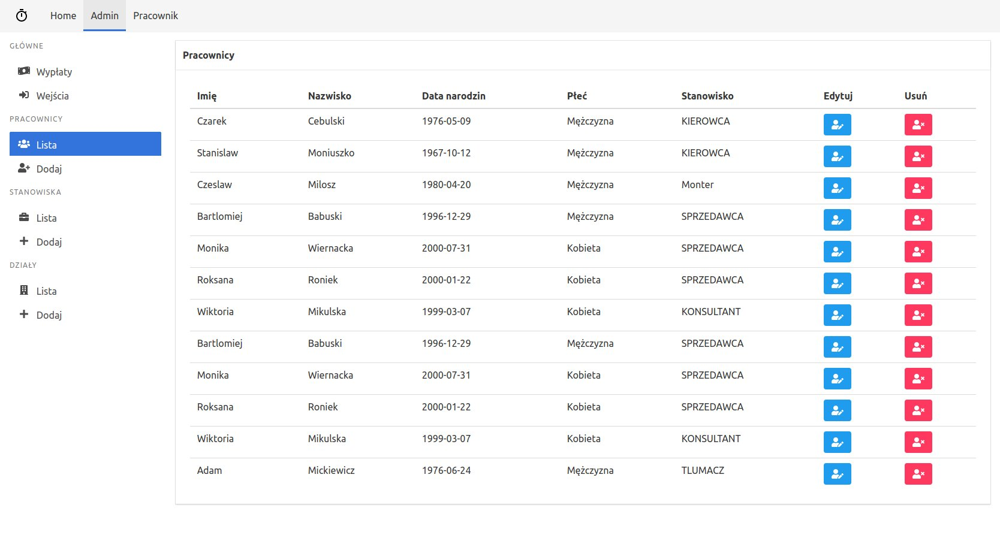
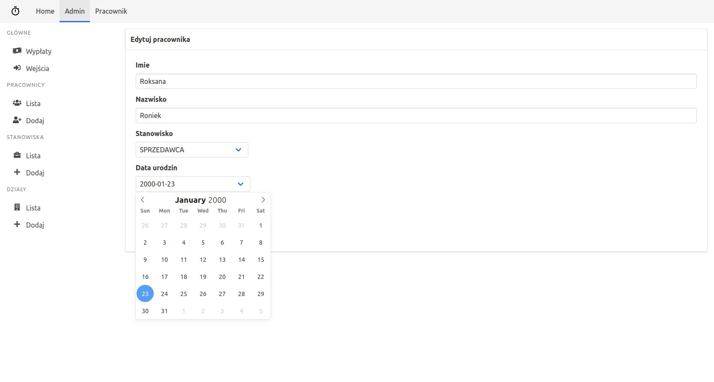
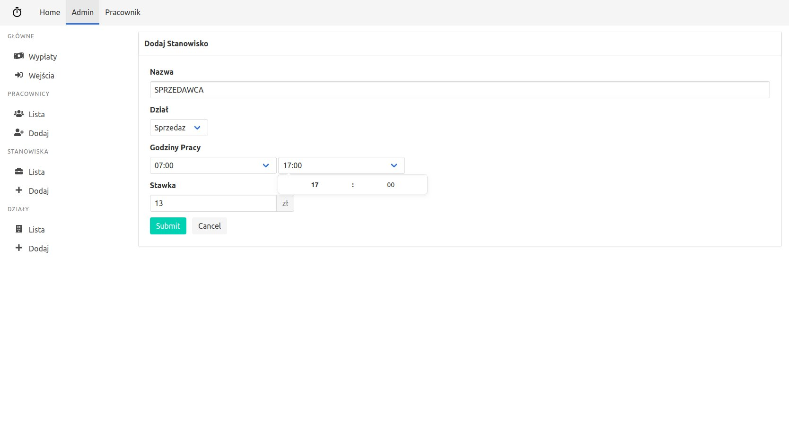
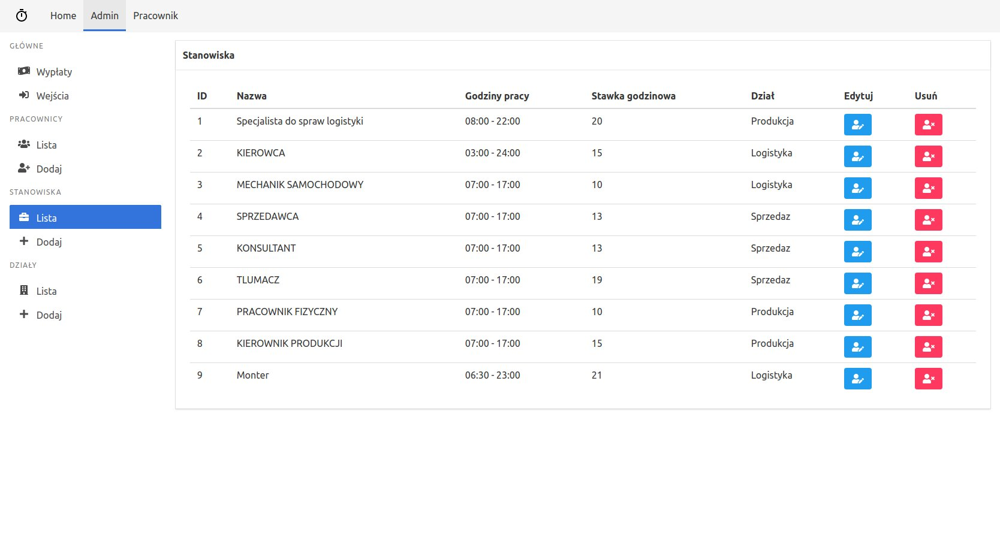

# System Rejestracji Czasu Pracy Pracowników

> Projekt stworzony z przyjacielem w ramach zadania na studiach. System zlicza przepracowane godziny danej osoby, a następnie wylicza należne mu wynagrodzenie. Klient bazuje na Vue, serwer na Node.js,a baza danych, to mySQL.

## Screenshoty 🖼️

## Technologie :wrench:

+ [Node.js](https://nodejs.org/)

+ [Vue](https://vuejs.org/)

+ [mySQL](https://www.mysql.com/)

+ [Bulma](https://bulma.io/)

## Autorzy

Karol Waliszewski – [karolwaliszewski@gmail.com](mailto:karolwaliszewski@gmail.com)

https://github.com/Karol-Waliszewski

Krzysztof Sobolewski – [kzsobolewski@gmail.com](mailto:kzsobolewski@gmail.com)

https://github.com/kzsobolewski
